# aws-VPC-three-tier-architecture-lab

## Objective  
To build a secure, highly available, three-tier web application architecture on AWS.  

---

## Part 0: Initial Setup & Foundational Resources  

### S3 Bucket Creation  
Created an S3 bucket named vpc-three-tier-project.  

Purpose: This bucket will store the application code that our EC2 instances will download and run.  

### IAM EC2 Instance Role Creation  
Action: Created an IAM role with two key policies attached:  

- AmazonS3ReadOnlyAccess: Grants permission for EC2 instances to download code from the S3 bucket.  
- AmazonSSMManagedInstanceCore: Enables secure management of EC2 instances through AWS Systems Manager Session Manager (no SSH keys needed!).  

Purpose: This role ensures our instances can securely access what they need without storing credentials on the machines themselves.  

---

## Part 1: Networking & Security  

### VPC and Subnets  

VPC Creation:  Created a VPC named 3-tier-vpc with the CIDR block 10.0.0.0/16.  
what is a VPC...: This VPC acts as my private network in the cloud, providing 65,536 possible IP addresses (from 10.0.0.0 to 10.0.255.255).  

Subnet Creation:  

Create six subnets across two Availability Zones (us-east-1a and us-east-1b) for each tier (Web, App, DB).  

The Plan: Carve the large VPC CIDR into smaller, non-overlapping blocks using a /20 mask (each providing 4,096 IPs).  

> Mistake: While creating the third subnet, I accidentally tried to use a /19 CIDR block (10.0.32.0/19). This block was too large and overlapped with the range of my first subnet (10.0.0.0/20), causing an error.  

  

> The Fix & Lesson: I corrected the CIDR to 10.0.32.0/20. This was a great hands-on lesson in how CIDR blocks work as its essential to avoid IP address overlap.  

Final Subnet Setup:  

- Public Web Subnets: 10.0.0.0/20 (AZ1), 10.0.48.0/20 (AZ2)  
- Private App Subnets: 10.0.16.0/20 (AZ1), 10.0.64.0/20 (AZ2)  
- Private DB Subnets: 10.0.32.0/20 (AZ1), 10.0.80.0/20 (AZ2)  

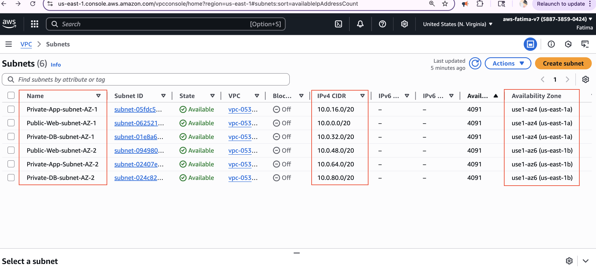  

---

### Internet Connectivity  

Internet Gateway (IGW):  

Created and attached an Internet Gateway named IGW-3-tier to the VPC.  

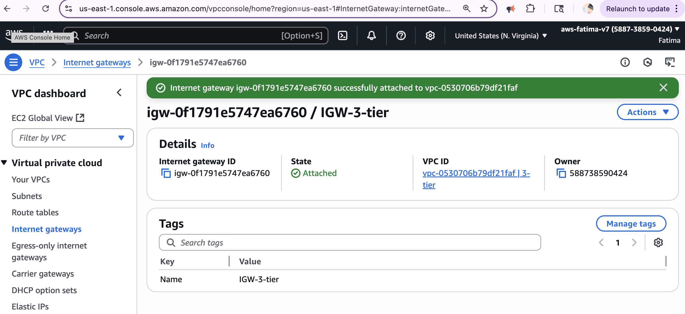  

Purpose: The IGW is the door between my VPC and the public internet. It allows resources in public subnets (like our web servers) to have direct inbound and outbound internet access.  

NAT Gateways:  

Created one NAT Gateway in each public subnet (web tier AZ1 and AZ2).  

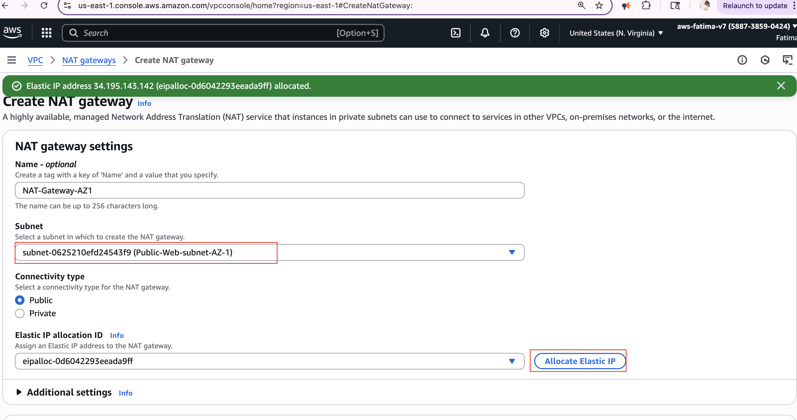  

Purpose: A NAT Gateway allows instances in private subnets (like our App Tier) to initiate outbound connections to the internet (e.g., to download updates) while blocking any unsolicited inbound traffic from the internet. This is a key security feature.  

Design: Each NAT Gateway in a public AZ provides internet access for the private subnets in that same AZ for high availability.  

---

### Routing Configuration  

Routing tables tell network traffic where to go. A subnet doesn't know if it's public or private until you tell it how to route traffic.  

Public Route Table:  

Created a route table named Public-Route-Table. Added a route sending all non-VPC traffic (0.0.0.0/0) to the Internet Gateway (IGW). Then, I explicitly associated the two Public Web Subnets with this route table.  

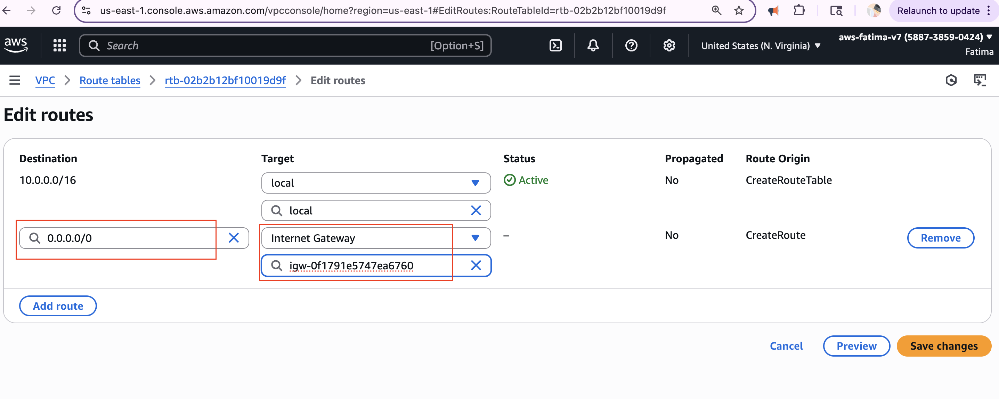  
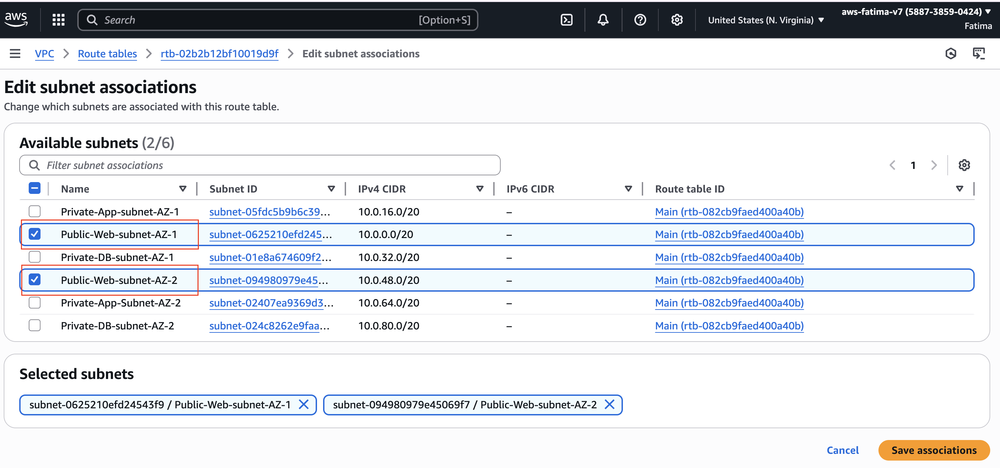  

Why explicit association? A route table is just a set of directions. You have to manually link it to the subnets that should use those directions. Without this association, the web subnets would never use the IGW.  

Private Route Tables:  

Action: Created two private route tables: Private-route-AZ1 and Private-route-AZ2.  

For each, I added a route sending all non-VPC traffic (0.0.0.0/0) to the NAT Gateway in its respective Availability Zone.  

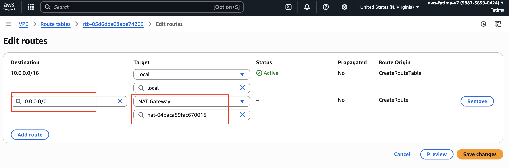  
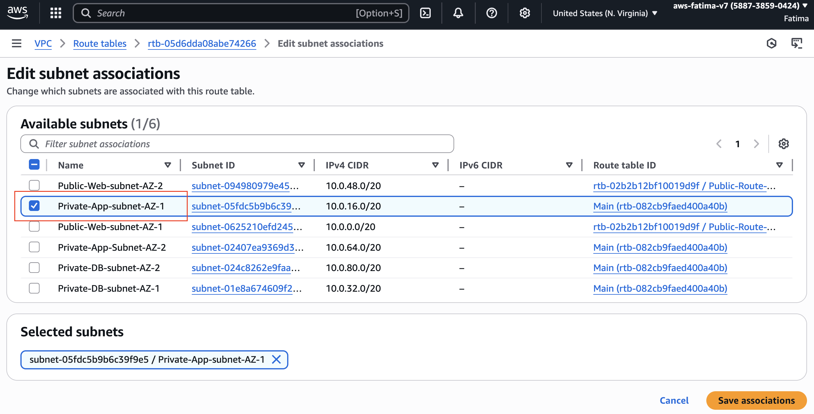  

I associated Private-route-AZ1 with the private App subnets in AZ1, and Private-route-AZ2 with the private App subnets in AZ2.  

Purpose: This ensures that if an app server in AZ1 needs to access the internet, its traffic goes through the NAT Gateway in AZ1, keeping the traffic flow within the same AZ for performance and cost efficiency.  

---

### Security Groups  

Security Groups = firewalls at instance level. They decide who can talk to what.  

Important: Always pick the 3-tier VPC, not Default VPC.  

External Load Balancer SG  

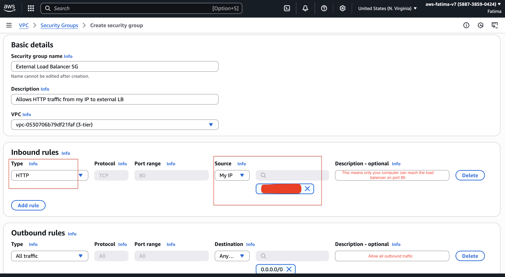  

The “front door.”  

Purpose: takes traffic directly from internet users.  

Rule: Allow HTTP (80) from my IP (so I can test).  

Web Tier SG (Public Instances)  

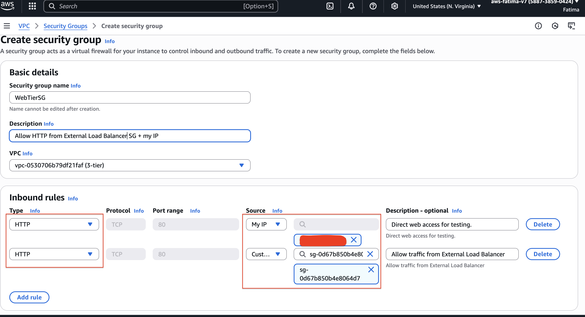  

These are the actual web servers.  

They don’t talk to the internet directly → only through the LB.  

Rules:  

- Allow HTTP (80) from External LB SG (so LB can forward).  
- Allow HTTP (80) from my IP (so I can test directly).  

Internal Load Balancer SG  

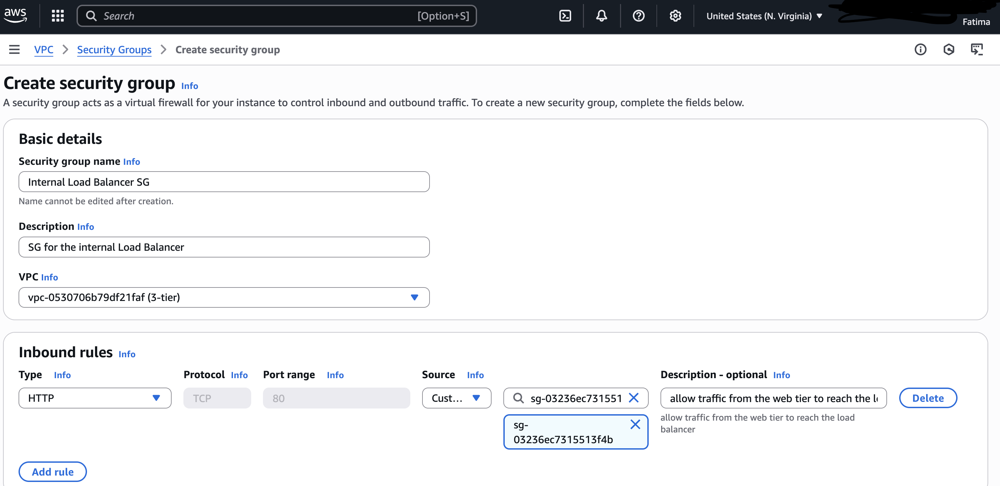  

Balances traffic between web and app tier.  

Only accepts traffic from Web Tier SG.  

Private Instance SG (App Tier)  

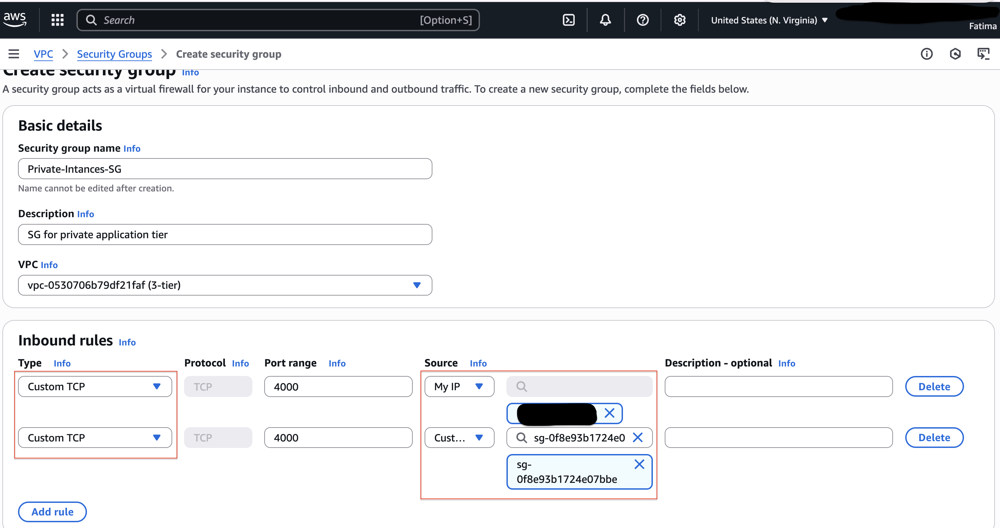  

These are the app servers, running on port 4000.  

Rules:  

- Port 4000 from Internal LB SG (so only the internal LB can talk to it).  
- Port 4000 from my IP (so I can test directly).  

>> Mistake encountered:  When setting up, I couldn’t find my Internal LB SG in the dropdown. Turns out I was in the wrong VPC, so it didn’t show up. Switched to 3-tier VPC, problem solved.  

DB SG (Database Tier)  

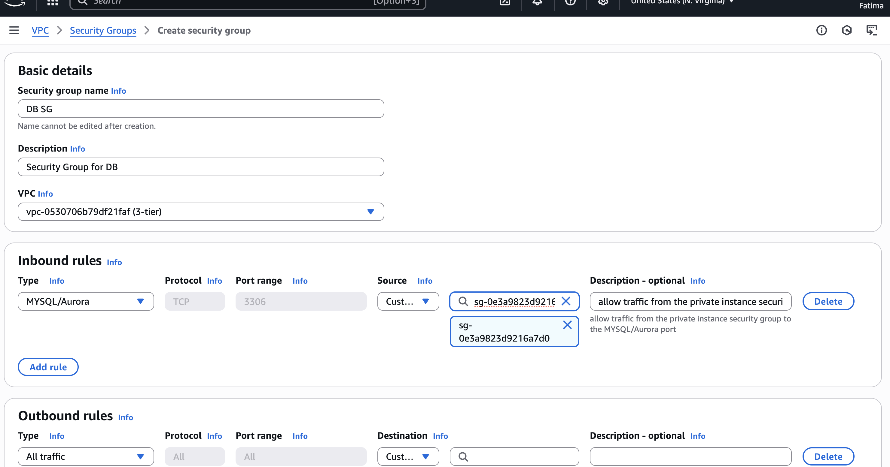  

These are DB servers.  

Only allow MySQL/Aurora (3306) from Private Instance SG.  

That way, only app tier can reach the DB.  

End-to-End Flow  

Internet → External LB SG → Web Tier SG → Internal LB SG → App Tier SG (4000) → DB SG (3306).  

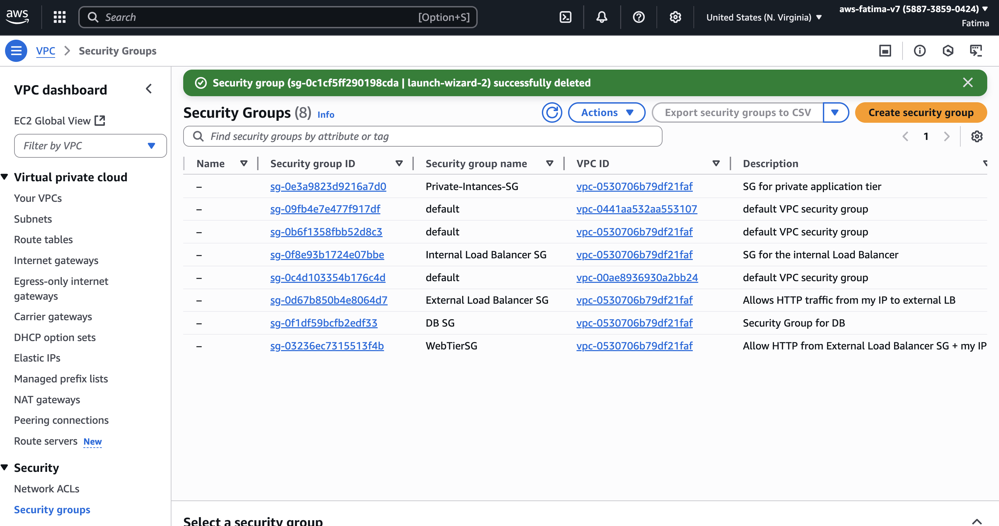  

---

## Part 2: Deploying database  

### Database Subnet Group Creation  

Purpose:  

A DB subnet group ensures that RDS (or Aurora) instances are deployed into specific private subnets across multiple Availability Zones, providing high availability and isolation from the public internet.  

Steps Taken:  

- Navigated to the RDS dashboard → Subnet groups → Create DB Subnet Group.  
- Named the group:  
  - Name: DB-subnet-group  
  - Description: Subnet group for the database tier in the VPC  
  - VPC: 3-tier (vpc-0530706b79df21faf)  
- When adding subnets, made sure to add the subnets created in each Availability Zone specifically for the database layer:  
  - Private-DB-subnet-AZ-1 (subnet-01e8a674609f2dd3b, 10.0.32.0/20, us-east-1a)  
  - Private-DB-subnet-AZ-2 (subnet-024c8262e9faa851c, 10.0.80.0/20, us-east-1b)  
- Verified subnets are isolated (private) and spread across two Availability Zones for redundancy.  

Result:  

The DB subnet group was created successfully and will be used in the next step when deploying the actual database instance.  
